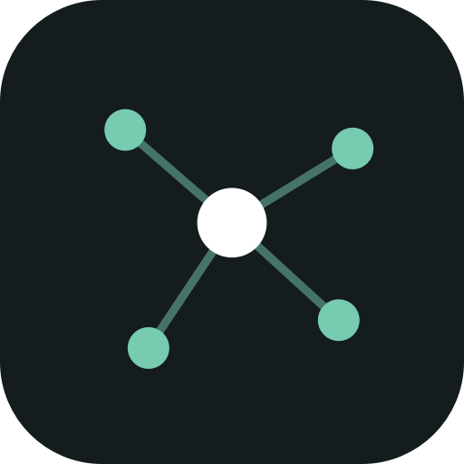
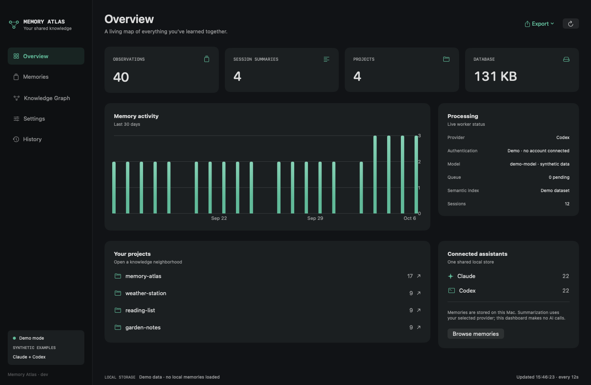
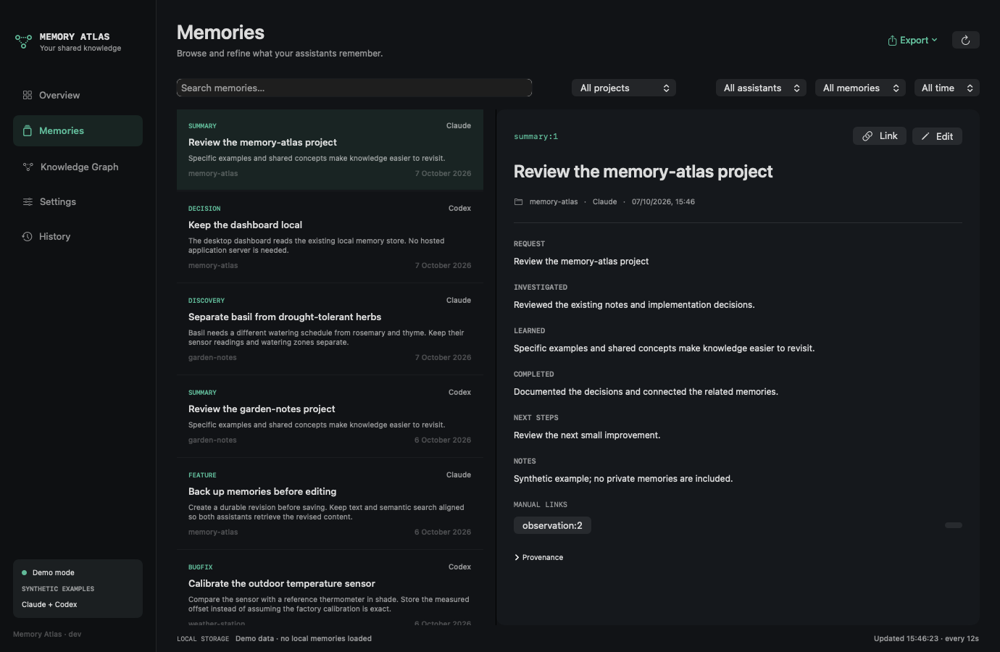
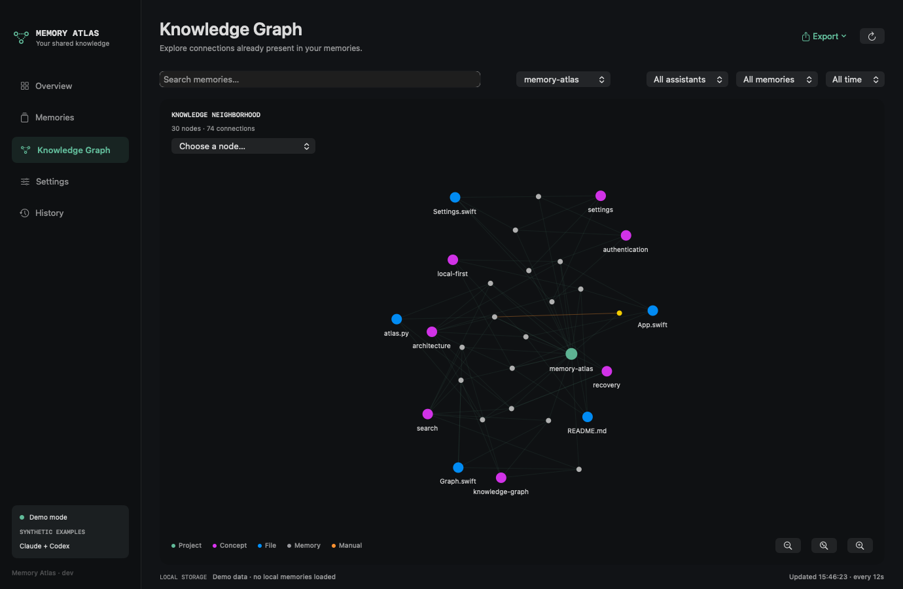
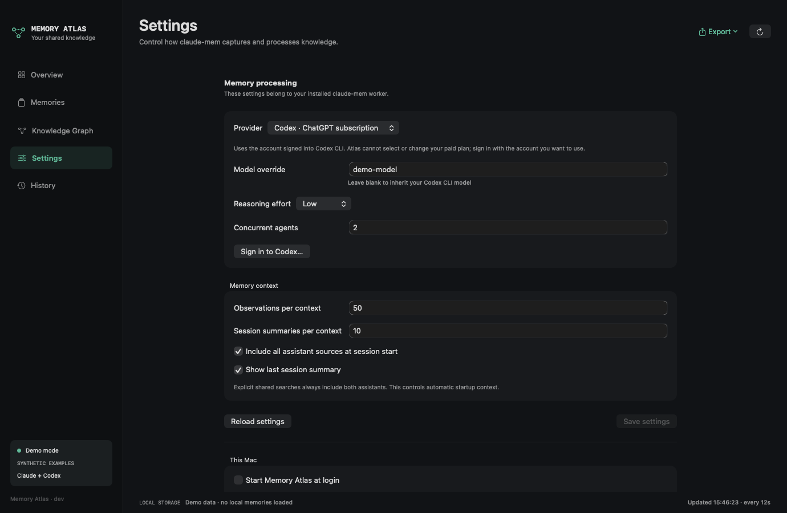

<p align="center">
  
</p>

<h1 align="center">Memory Atlas</h1>
<p align="center"><strong>A native macOS dashboard for your claude-mem knowledge.</strong><br>See what your AI assistants remember. Connect it, refine it, and take it with you.</p>

<p align="center">
  <a href="https://github.com/aktoriukas/memory-atlas/releases"></a>
  <a href="LICENSE"></a>
  
  <a href="https://github.com/thedotmack/claude-mem"></a>
  <a href="https://github.com/aktoriukas/memory-atlas/actions/workflows/ci.yml"></a>
</p>



Memory Atlas gives [**claude-mem**](https://github.com/thedotmack/claude-mem) a dedicated Mac window and menu-bar home. It browses the observations and session summaries in your existing local store, including Claude and Codex records when both assistants use that store.

**claude-mem captures and retrieves the memories. Atlas helps you understand and manage them.** This is an independent companion, not a replacement or an official upstream product.

[Download](https://github.com/aktoriukas/memory-atlas/releases) · [Installation](#install) · [How it works](#how-it-works) · [Contributing](CONTRIBUTING.md)

## What you can do

- **Monitor your memory:** observation and summary counts, projects, assistant totals, activity, processing queue, provider/model, and semantic-index health.
- **Find a memory:** search text and filter by project, assistant, date, or observation/summary kind. Inspect content and provenance together.
- **Explore a knowledge graph:** shared projects, concepts, and files create connections without extra AI calls. Add your own links between memories.
- **Refine shared knowledge:** edit the actual stored observations and summaries, with automatic database backups, stale-write protection, undo, and interrupted-save recovery.
- **Control processing:** configure supported claude-mem providers, models, reasoning effort, and startup context. Subscription authentication uses your existing CLI account.
- **Export your notes:** JSON archives or an Obsidian-compatible Markdown vault with project pages, concept tags, and manual wiki links.
- **Keep it close:** open the dashboard from the menu bar; launch automatically at macOS login.

No Electron, browser dashboard, hosted Atlas service, telemetry, or additional AI inference is needed. The UI uses SwiftUI/AppKit and a small local Python subprocess for data access.

## Install

### 1. Have a local claude-mem installation

Follow the [official claude-mem installation guide](https://docs.claude-mem.ai/installation). Run at least one assistant session so its local database exists. Atlas does not install claude-mem, register assistant hooks, or configure cloud services for you.

**Compatibility:** this first release is tested against **claude-mem 13.29.0**, with a local SQLite store and local Chroma. Editing is deliberately refused on other worker versions until their storage and indexing contracts are reviewed. Newer versions may allow browsing if their schema is compatible; do not assume full support. See [compatibility details](docs/COMPATIBILITY.md).

Atlas needs **Python 3.9+** for its local bridge. If you do not already have it, [Homebrew's Python 3.13 formula](https://formulae.brew.sh/formula/python@3.13) is an option:

```sh
brew install python@3.13
```

Bun and the cached Chroma runtime are needed for editing and worker controls; normally your local claude-mem installation supplies them. No Python packages are installed when you save a memory.

### 2. Download the app

1. Open the [Releases page](https://github.com/aktoriukas/memory-atlas/releases).
2. Download **`Memory-Atlas-0.1.0-arm64.zip`** for Apple Silicon, or **`Memory-Atlas-0.1.0-x86_64.zip`** for an Intel Mac. Use **Apple menu → About This Mac** if you are unsure.
3. Unzip, then move **Memory Atlas.app** to `~/Applications` or `/Applications`.
4. Open it. The dashboard connects to the local store configured in `~/.claude-mem/settings.json`.
5. Click the connected-nodes icon in the menu bar to reopen the dashboard. Closing the window keeps the app running; use **Memory Atlas → Quit Memory Atlas** to stop it.

Requires **macOS 14 or newer**. The initial binaries are **ad-hoc signed and not Apple notarized**. macOS may block the first launch. Review [Apple's guidance for opening a trusted app](https://support.apple.com/en-us/102445), or build from source below. Do not disable Gatekeeper globally. SHA-256 checksums are attached to each release:

```sh
# Run in the folder containing the downloaded ZIP files and SHA256SUMS.txt.
shasum -a 256 -c SHA256SUMS.txt --ignore-missing
```

Only the architecture you downloaded needs to be present. A checksum checks download integrity; it is not an Apple notarization or an independent authenticity guarantee.

### 3. Choose login startup

Atlas requests login registration on its first normal launch. If macOS asks for approval, finish in **System Settings → General → Login Items**. Change it later in **Atlas → Settings → Start Memory Atlas at login**. Install the app in its final location before enabling this.

### Build from source

Install Apple's command-line tools if needed (`xcode-select --install`), with **Swift 6.0+**, then:

```sh
git clone https://github.com/aktoriukas/memory-atlas.git
cd memory-atlas
./scripts/install.sh
```

This builds for your Mac's architecture, installs to `~/Applications/Memory Atlas.app`, and opens it. It does not modify assistant hooks or install new AI dependencies. To build without installing:

```sh
./scripts/build.sh            # this Mac's architecture
./scripts/build.sh arm64      # Apple Silicon
./scripts/build.sh x86_64     # Intel
```

### Preview with invented memories

No claude-mem setup is needed to try the read-only demo; Python is still required:

```sh
open -na "$HOME/Applications/Memory Atlas.app" --args --demo
```

Demo mode uses temporary synthetic data, does not connect an account or register login startup, and refuses edits/settings/exports. Quit the demo and launch normally to return to your own store. The documentation images below are rendered from the actual native views using this synthetic dataset.

## How it works

### Overview

The overview refreshes every 12 seconds. It combines local database counts with the worker's health, queue, provider/authentication, and Chroma status. Project rows open graph neighborhoods.

The displayed model is the configured override or detected Codex CLI default; provider-side routing or a CLI profile can affect the model actually used. Atlas cannot measure subscription allowance or choose a different paid plan for you.

### Memory browser and editing



Open **Memories**, filter or search, then select a record. Details retain the memory ID, assistant source, session, creation time, and available model provenance. Use **Link** to connect it to another ID, such as `observation:12` or `summary:3`.

**Edit** changes the shared store, so future assistant retrieval can use your correction. Before saving, Atlas stops the worker, acquires its Chroma writer lock, saves an online SQLite backup and durable revision, then updates SQLite/FTS and reconciles the memory's semantic documents. Removed fact chunks are deleted, and the worker resumes after a consistent result. A write transaction protects against concurrent content updates.

Open **History** to undo a completed edit or recover an interrupted one. Undo refuses to overwrite later changes. Atlas retains the three newest full database snapshots and per-memory revision history. It does not edit raw prompts or provenance fields.

### Knowledge graph



Start with the project overview, then choose a project or enter a search. **Projects, concepts, and files are hubs**; observations and summaries connect through their existing metadata. Orange edges represent manual links.

Drag to pan, pinch or use the magnifying buttons to zoom, and click a node to inspect it. The **Choose a node** selector also supports keyboard navigation. Open a memory from its inspector to read or edit it.

Neighborhoods show up to **240 recent memories and 45 entity hubs**. Narrow the filters to explore other records. This keeps a large store usable without inferring new relationships or running AI calls. It is a metadata graph, not an embedding-similarity map.

### Provider, model, and subscription settings



Settings expose the options supported by the installed worker: Codex, Claude, Gemini, OpenRouter, and OpenAI-compatible endpoints. Save changes, then use **Restart worker** when needed to apply a provider/model change.

| Provider | Authentication and model selection |
| --- | --- |
| Codex | The account signed into Codex CLI; blank model override inherits the CLI default. |
| Claude | Claude subscription or existing Anthropic API credential configuration; model and summary override controls. |
| Gemini / OpenRouter | Provider API key and model. |
| OpenAI compatible | Endpoint, model, and optional API key; can point to a compatible local server. |

**A subscription belongs to the signed-in account.** Atlas can open the CLI sign-in flow; it cannot purchase, switch, or cancel a subscription. API usage follows the selected provider's billing. Atlas does not copy CLI authentication tokens. Credential entry uses secure fields and the worker's existing settings storage.

### Export to JSON or Obsidian

Use **Export** to save all memories or the current filters. Each export creates a new folder; existing files are not overwritten.

JSON includes the exported records and manual links. Markdown also includes YAML frontmatter, stable `observation-ID.md` / `summary-ID.md` filenames, project index pages, concept tags, and manual `[[wiki links]]`. In Obsidian, choose **Open folder as vault** and select that export.

Exports are snapshots, not a sync or import mechanism. Editing exported Markdown does not change claude-mem. The exported content is plaintext; choose its destination accordingly.

## Privacy and storage

- **Atlas opens no network listener** and makes no AI inference calls. It talks to the configured worker on loopback (`127.0.0.1`).
- The actual shared database remains in the claude-mem data directory. Atlas state, manual links, backups, and revisions live in `~/Library/Application Support/Memory Atlas/`.
- The current AI provider can still receive content for summarization. Retrieved memories may also be sent as part of your assistant's conversation. **Local memory storage does not imply local AI processing.**
- Atlas does not enable cloud sync. Editing requires local Chroma and is refused for configured cloud sync, replicated records, custom embedding functions, incompatible worker versions, or ambiguous collections.
- No real memories, credentials, exports, or personal paths are included in this repository or its screenshots.

See [security reporting](SECURITY.md) and [third-party acknowledgments](THIRD_PARTY_NOTICES.md).

## Troubleshooting and removal

| Symptom | What to check |
| --- | --- |
| No database found | Install/run claude-mem and start an assistant session. Check its configured data directory. |
| Worker offline | Local browsing can still work. Check claude-mem first, or use Atlas's Start worker control. |
| Python bridge error | Install Python 3.9+ in a supported Homebrew location, then relaunch. |
| Editing refused after an upgrade | This adapter is reviewed for 13.29.0 only. Keep browsing where compatible and report the new version; do not bypass the guard. |
| Missing Chroma environment | Let claude-mem initialize its local semantic index, then retry. Atlas reuses its cached `chroma-mcp` environment. |
| Interrupted edit | Use **History → Recover interrupted edits** before making another change. Keep the backup/revision files. |
| Login startup disabled | Approve Atlas in macOS Login Items; keep the app in its installed location. |
| Quota cooldown | Wait for the provider's allowance to reset. Restarting the worker does not increase subscription allowance. |

To remove Atlas, disable **Start at login**, quit, and move the app to Trash. Its state folder is retained so backups remain available. Remove that folder separately only if you want to discard Atlas links and revision history. **Do not remove `~/.claude-mem` to uninstall Atlas**; that is the upstream memory store.

## Development and releases

See [CONTRIBUTING.md](CONTRIBUTING.md) for isolated checks, screenshot regeneration, architecture, and contributions. [CHANGELOG.md](CHANGELOG.md) records releases; [docs/RELEASING.md](docs/RELEASING.md) describes version tags and release assets. Versions follow SemVer, with `VERSION` as the source of truth.

## Credits and license

Built for the [claude-mem](https://github.com/thedotmack/claude-mem) community. Thanks to [Alex Newman / thedotmack](https://github.com/thedotmack) and the upstream contributors for the capture, retrieval, and storage foundation. If Atlas is useful, consider starring **both projects**.

Memory Atlas's original code is [MIT licensed](LICENSE). The upstream compatibility schema retains its Apache-2.0 license; see [THIRD_PARTY_NOTICES.md](THIRD_PARTY_NOTICES.md). This project is independent of claude-mem, Anthropic, OpenAI, and Obsidian.
